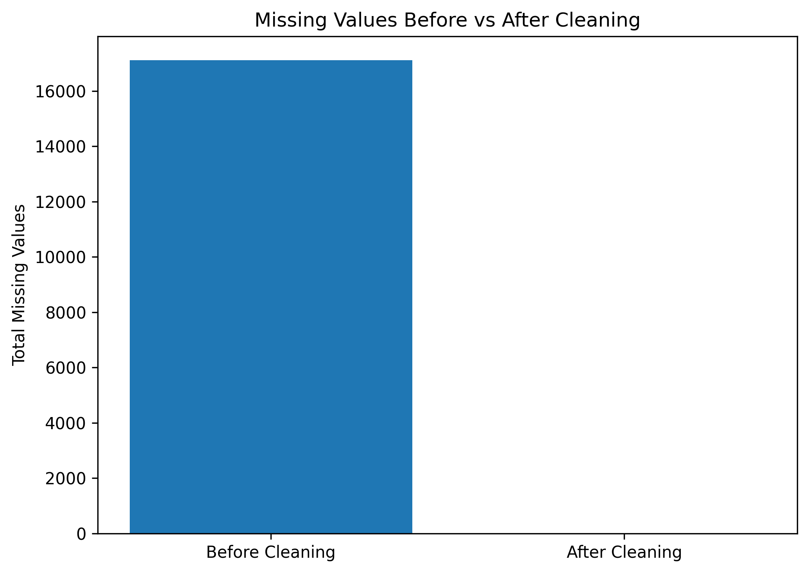

# Null Values Data Cleaning Project

## Project Overview

This project focuses on identifying and handling missing values in an employee-related dataset using Python, Pandas, NumPy, and Jupyter Notebook. The objective is to improve data quality and prepare the dataset for further analysis.

## Objectives

* Identify missing values in each column.
* Detect and remove completely empty rows.
* Handle missing categorical and numerical values.
* Convert columns to appropriate data types.
* Verify the cleaned dataset.
* Export the cleaned data into Excel and CSV formats.
* Visualize missing values before and after cleaning.

## Tools & Technologies

* Python
* Pandas
* NumPy
* Matplotlib
* Jupyter Notebook
* Microsoft Excel

## Dataset Information

The dataset contains employee-related information, including:

* Employee ID
* Name
* Age
* Gender
* Department
* Salary
* Experience
* City
* Education
* Performance
* Projects
* Joining Year

The original dataset contains missing values and completely empty rows.

## Data Cleaning Process

1. Loaded the original Excel dataset using Pandas.
2. Checked missing values in each column.
3. Identified and removed completely empty rows.
4. Filled missing categorical values using the mode.
5. Filled missing numerical values using the median.
6. Converted integer-like columns and text columns to appropriate data types.
7. Verified that no missing values remained in the cleaned dataset.
8. Exported the cleaned dataset to Excel and CSV formats.
9. Created a chart comparing missing values before and after cleaning.

## Key Results

* Identified and removed 200 completely empty rows.
* Handled missing values using mode and median imputation.
* Converted columns to suitable data types.
* Verified that the cleaned dataset contains zero missing values.
* Exported the cleaned dataset into Excel and CSV formats.

## Missing Values: Before vs After

The following chart compares the total number of missing values before and after data cleaning.



## Project Structure

```text
Null-Values-Data-Cleaning/
│
├── data/
│   ├── large_null_dataset.xlsx
│   ├── cleaned_dataset.xlsx
│   └── cleaned_dataset.csv
│
├── notebooks/
│   └── Null_Values_Data_Cleaning.ipynb
│
├── images/
│   └── missing_values_comparison.png
│
├── README.md
└── .gitignore
```

## Output Files

* `cleaned_dataset.xlsx` — Cleaned dataset in Excel format.
* `cleaned_dataset.csv` — Cleaned dataset in CSV format.
* `Null_Values_Data_Cleaning.ipynb` — Notebook containing the data cleaning steps.
* `missing_values_comparison.png` — Visualization of missing values before and after cleaning.

## How to Run the Project

1. Clone or download this repository.

2. Install the required libraries:

   `pip install pandas numpy matplotlib openpyxl`

3. Open `notebooks/Null_Values_Data_Cleaning.ipynb` in Jupyter Notebook.

4. Run the notebook cells in order.

## Skills Demonstrated

* Data Cleaning
* Missing Value Handling
* Pandas and NumPy
* Data Type Conversion
* Data Visualization
* Excel and CSV File Handling
* Jupyter Notebook

## Author

**Deepak Kumar Sah**
Aspiring Data Analyst | Python | SQL | Excel | Power BI

GitHub: [deepak-kumar-sah](https://github.com/deepak-kumar-sah)
